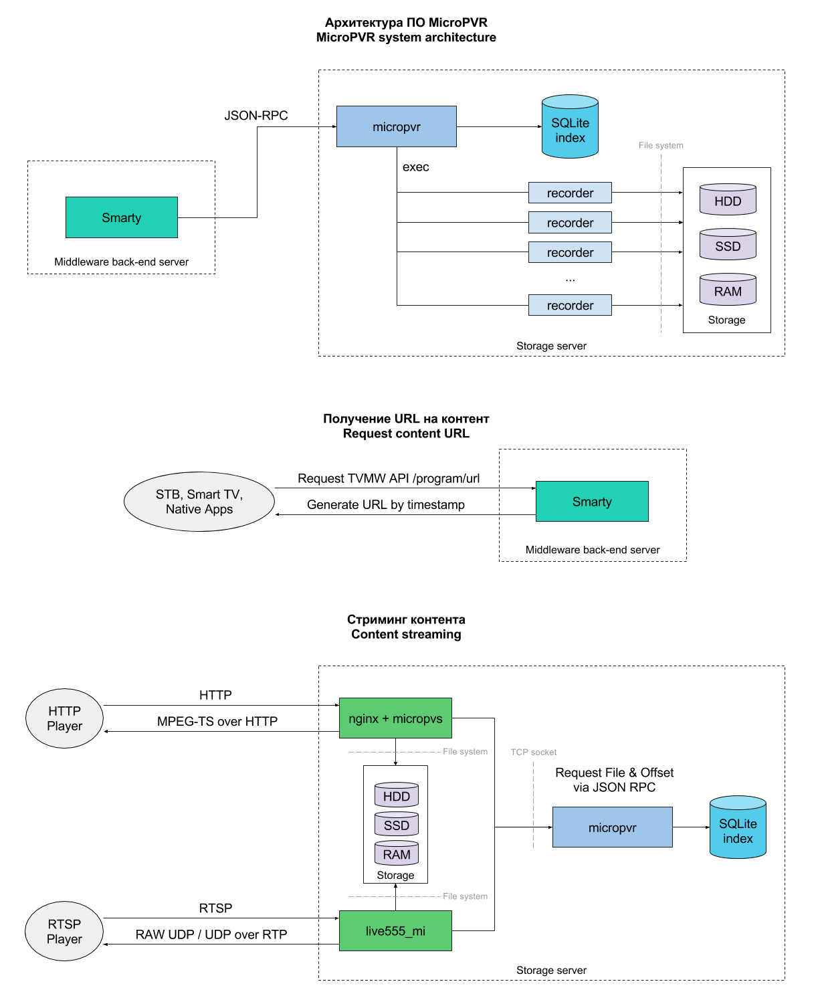

.. _micropvr:

********
Описание
********

**MicroPVR** - комплекс программного обеспечения, предназначенный для создания видео-сервера записи Live-контента и
предоставления абонентам интерактивных видео-сервисов, таких как отложенный просмотр (Catch Up), видеомагнитофон (NPVR),
пауза (Pause TV), просмотр в сдвиге (Timeshift) и других.

Благодаря наличию API возможно создание собственных интерактивных сервисов.

Позволяет задействовать различные виды памяти СХД, например HDD, SSD, RAM, что позволяет создавать конфигурации для
обслуживания до 10Gbps абонентского трафика на один сервер.

.. _architecture:

Описание архитектуры
====================

**micropvr** - менеджер видео-записей. Управляющий процесс, реализующий API-интерфейс в формате JSON и взаимодействующий с
процессами записи контента.

**recorder** - модуль записи контента в формате MPEG-TS.

**micropvs** - модуль для nginx, взаимодействует с micropvr и предназначен для вещания записанных передач в формате HTTP
MPEG-TS.

**live555_mi** - модифицированная версия видео-сервера `Live555MediaServer <http://www.live555.com/mediaServer/>`_, взаимодействует с micropvr и предназначен для
вещания записанных передач в формате RTSP/UDP/RTP.

.. _system-requirements:

********************
Системные требования
********************

ПО MicroPVR предназначено для работы в ОС Linux Debian 64-битной версии и подобных
дистрибутивах, по-умолчанию поставляется версия для архитектуры amd64.

*Внимание! ПО MicroPVR не предназначено для работы на виртуальной машине по причине негарантированной стабильности
работы виртуального сетевого адаптера.*

Требования к аппаратному обеспечению, исходя из принимаемого/передающегося объема трафика:

+--------------------+------------------------------------------------------------------------------------------------------+
| Процессор          | 1 ядро 2.4Ghz+ на каждые 400Mbps трафика                                                             |
+--------------------+------------------------------------------------------------------------------------------------------+
| Оперативная память | 1GB на каждые 400Mbps трафика                                                                        |
+--------------------+------------------------------------------------------------------------------------------------------+
| Сетевая карта      | карта с Enterprise чипом Intel, имеющая несколько очередей для входящих пакетов (multiple Rx queues) |
+--------------------+------------------------------------------------------------------------------------------------------+

Расчет суммарного объема хранилища
==================================

Если: ::
    M - количество каналов определенного битрейта/качества
    N - средний битрейт одного канала в мегабитах в секунду
    K - глубина записи архива в днях
    X - результат расчета в терабайтах

Тогда формула расчета: ::
    X = ((((M * N) / 8) * 3600 * 24 * K) / 1024) / 1024

Например, 100 каналов SD в битрейте 3.5Mbps необходимо записывать на 7 дней: ::
    ((((100 * 3.5) / 8) * 3600 * 24 * 7) / 1024) / 1024 = 25,23TB

Расчет конфигурации хранилища
=============================

Конфигурация серверов может быть подобрана индивидуально исходя из бюджета и технических требований.
Рекомендованные значения - записывать не более 50 каналов на один сервер, исходя из этого, если: ::

    M - количество каналов определенного битрейта/качества
    N - средний битрейт одного канала в мегабитах в секунду
    K - глубина записи архива в днях
    X - общий объем хранилища
    Y - количество серверов

Тогда формула расчета: ::
    M = 50
    Y = X / (((((M * N) / 8) * 3600 * 24 * K) / 1024) / 1024)

При количестве одновременных запросов на сервис PVR, равном 1000 на каждый сервер
(т.е. суммарно 1000*Y одновременных пользователей), количество дисков хранилища на одном сервере должно
быть не менее 6, количество SSD в размере 500GB не менее 2.

При необходимости резервирования СХД количество дисков следует увеличить исходя из выбранной модели резервирования (RAID Level).

.. _install-and-using:

*************************
Установка и использование
*************************

Для работы micropvr необходимо наличие установленных библиотек *libjsonrpc*, *libjson*.

MicroPVR, а также все сопутствующие пакеты и необходимые библиотеки совместимых версий, поставляются в виде
установочных deb-пакетов и устанавливаются утилитой dpkg. См. :ref:`Где взять <download-software>`.

micropvr
========

Для запуска micropvr используется init.d скрипт: ``/etc/init.d/micropvr``: ::

    $ /etc/init.d/micropvr
    Usage: /etc/init.d/micropvr {start|stop|restart|force-reload|reload}

Файлы логов по-умолчанию сохраняются в ``/var/log/micropvr/micropvr.log``,
включена ротация логов через logrotate.d

nginx + micropvs
================

Для запуска nginx с модулем micropvs используется init.d скрипт: ``/etc/init.d/micropvs``: ::

    $ /etc/init.d/micropvs
    Usage: /etc/init.d/micropvs {start|stop|restart|force-reload|reload}

Файлы логов по-умолчанию сохраняются в ``/usr/local/nginx-micropvr/logs/``,
включена ротация логов через logrotate.d

live555_mi
==========

Для запуска live555_mi используется init.d скрипт: ``/etc/init.d/live555_mi``: ::

    $ /etc/init.d/live555_mi
    Usage: /etc/init.d/live555_mi {start|stop|restart|force-reload|reload}

Файлы логов по-умолчанию сохраняются в ``/var/log/live555_mi/``,
включена ротация логов через logrotate.d

.. _download-software:

Где взять
=========

Для всех
  Скачать необходимые инсталляционные пакеты можно в официальном техническом сообществе Microimpuls
  по ссылке http://forum.micro.im/ в разделе "Дистрибутивы и обновления ПО".

Для инженеров Microimpuls
  При установке ПО на сервер через систему оркестровки все необходимые установочные пакеты
  актуальных версий скачиваются из репозитория автоматически.

.. _configuration:

Конфигурация
============

.. _micropvr_configuration:

micropvr
--------

Файл конфигурации находится в ``/etc/micropvr/micropvr.conf``,
задаётся в формате JSON. Пример: ::

    {
        "log-foreground": false,
        "log-syslog": false,
        "log-verbose-level": 3,
        "log-path": "/var/log/micropvr/micropvr.log",
        "log-state-period": 0, // in Minutes
        "log-state-path": "/var/log/micropvr/micropvr_state.log",
        "json-rpc-listen-host": "0.0.0.0",
        "json-rpc-listen-port": 4089,
        "task-postpone-time": 60,
        "records-checking-period": 60,
        "records-outdated-checking-period": 5,
        "records-removing-period": 5,
        "records-min-free-space": 10000, // space in MiB
        "records-default-reserve-size": 20480, //space in MiB
        "recorder-check-free-space": true,
        "recorder-pid-path": "/var/run/micropvr/",
        "recorder-cmd": "recorder",
        "recorder-log-enabled": true,
        "recorder-log-path": "/var/log/micropvr/recorder.log",
        "recorder-init-timeout": 5,
        "recorder-checking-period": 1
    }

.. _micropvr-options-description:

Описание параметров micropvr
~~~~~~~~~~~~~~~~~~~~~~~~~~~~

log-syslog ``bool``
  Использовать ли службу syslogd для записи логов в /var/log/syslog.
  Не рекомендуется включать при интенсивном логировании.

log-facility ``int``
  Тег в syslog.

log-path ``str``
  Путь до лог-файла для логирования напрямую без syslogd.

log-verbose-level ``int``
  Уровень логирования от 0 до 5, 5 - максимальный DEBUG уровень.

log-state-period ``int``
  *С версии 1.5.0*
  
  Период записи лога состояния в минутах. При значении 0 запись отключается.
  
log-state-path ``str``
  *С версии 1.5.0*
  
  Путь до файла в который будет записываться лог состояния.
  
log-foreground ``bool``
  Вывод лога в stdout.

json-rpc-enabled ``bool``
  Включает интерфейс JSON RPC API. Через этот API без перезапуска micropvr
  отдельные потоки могут быть приостановлены или перезапущены.

json-rpc-listen-host ``str``
  Адрес интерфейса для ожидания входящих подключений к JSON RPC API.
  Значение "0.0.0.0" означает слушать на всех интерфейсах.

json-rpc-listen-port ``int``
  Номер порта TCP для JSON RPC API, по-умолчанию 9089.

task-activation-period ``int``
  *Убрано в версии 1.5.0*
  
  Время в секундах, задающее условие: в очередь запуска попадают задачи,
  выполнение которых должно наступить в течение ближайших N секунд.
  По-умолчанию 900.

task-caching-period ``int``
  *Убрано в версии 1.5.0*
  
  Период кеширования задач внутренним планировщиком, в секундах, по-умолчанию 450.

records-outdated-checking-period ``int``
  Период проверки и удаления устаревших записей на диске.

records-removing-period ``int``
  Минимальный интервал удаления устаревших записей.

records-min-free-space ``int``
  *С версии 1.2.1*
  
  Минимальный объем свободного места на диске в MiB, при котором разрешена запись.
  
records-default-reserve-size ``int``
  *С версии 1.4.0*
  
  Объём резервируемого на диске места для одной активной записи в MiB, по умолчанию 20480.
  Запись не будет производится, если включен механизм проверки свободного места на диске и объём места после резервирования станет меньше минимально разрешённого.

recorder-check-free-space ``bool``
  *С версии 1.2.1*
  
  Определяет включение механизма проверки свободного места на диске.
  
recorder-cmd ``str``
  *С версии 1.5.0*
  
  Команда запуска модуля MicroPVR recorder, который осуществляет запись
  потока в файл (для запуска recorder и совместимых по CLI-интерфейсу программ).
  По умолчнию "recorder".

recorder-pid-path ``str``
  Путь для записи pid-файлов recorder'ов, по-умолчанию "/var/run/micropvr".

recorder-log-enabled ``bool``
  Разрешить писать recorder'у в лог, по-умолчанию false.

recorder-log-path ``str``
  Путь до лог-файла recorder'а, по-умолчанию "/var/log/micropvr/recorder.log"

recorder-init-timeout ``int``
  Время в секундах на перезапуск recorder'a в случае неудачного старта,
  по-умолчанию 5. Если recorder не удалось запустить за это время, выполнение
  задачи будет отложено.

recorder-cheking-period ``int``
  Период проверки состояния recorder'ов, в секундах, по-умолчанию 1.

.. _micropvs_configuration:

micropvs
--------

Файл конфигурации находится в ``/usr/local/nginx-micropvr/conf/nginx.conf``,
пример: ::

    worker_processes 16;
    events {
        worker_connections 4096;
        use epoll;
        multi_accept on;
    }
    http {
        access_log logs/access.log;
        error_log logs/error.log;
        include mime.types;
        default_type application/octet-stream;
        sendfile on;
        tcp_nopush on;
        tcp_nodelay on;
        keepalive_timeout 5;
        send_timeout 36000;
        server {
            listen 8080;
            location / {
                pvr_api_host "127.0.0.1";
                pvr_api_port 4089;
                ts;
            }
            location = /nginx-stats {
                stub_status on;
                access_log off;
                allow 127.0.0.1;
                deny all;
            }
        }
    }

.. _micropvs-options-description:

Описание параметров micropvs
~~~~~~~~~~~~~~~~~~~~~~~~~~~~

pvr_api_host ``str``
  IP-адрес JSON-RPC API процесса micropvr.

pvr_api_port ``int``
  Порт JSON-RPC API процесса micropvr.

ts
  Подключение модуля micropvs.

Остальные параметры стандартные для сервера `nginx <http://nginx.org/en/docs/>`_.

.. _monit-script:

Скрипт для monit
================

Для слежения за процессами micropvr удобно использовать monit, пример скрипта: ::

    check process micropvr with pidfile /var/run/micropvr.pid
        start program = "/etc/init.d/micropvr start" with timeout 60 seconds
        stop program  = "/etc/init.d/micropvr stop"
        if cpu > 60% for 2 cycles then alert
        if cpu > 90% for 5 cycles then restart
        if totalmem > 6000.0 MB for 5 cycles then restart
        if 3 restarts within 5 cycles then timeout
        group micropvr

.. _state_log:

*************
Лог состояния
*************

Если параметр log-state-period больше нуля, то micropvr с заданной переодичностью будет вести лог состояния.

Вид записей лога: ::

  Log OK: 12/10 13:28:59
  Mem used: 958868 KiB, mem free: 3099672 KiB
  Swap used: 127652 KiB, swap free: 8257880 KiB
  CPU load: 8.2%

  ____________________________________________________________________________________________________________________________________________________
  | CID   | CHANNEL NAME  | SOURCE                | START TIME     | STOP TIME      | LOCK TIME      | REPEAT     | LOCATION      | PRIOR | STATUS    |
  ----------------------------------------------------------------------------------------------------------------------------------------------------
  | 1     | channel1      | udp://@239.1.2.3:1234 | 12/10 15:00:00 | 12/10 16:00:00 | 13/10 16:00:00 | 3600 secs  | /tmp/pvr/ch_1 | 3     | NEW       |
  | 2     | channel2      | udp://@239.1.2.3:1235 | 12/10 15:00:00 | 12/10 16:00:00 | 13/10 16:00:00 | 3600 secs  | /tmp/pvr/ch_2 | 3     | NEW       |
  | 3     | channel3      | udp://@239.1.2.3:1236 | 12/10 13:00:00 | 12/10 14:00:00 | 14/10 14:00:00 | 3600 secs  | /tmp/pvr/ch_3 | 3     | STARTED   |
  | 3     | channel3-ssd  | udp://@239.1.2.3:1236 | 12/10 13:00:00 | 12/10 14:00:00 | 14/10 14:00:00 | 3600 secs  | /ssd/pvr/ch_3 | 5     | STARTED   |
  | 4     | channel4      | udp://@239.1.2.3:1236 | 12/10 13:29:10 | 12/10 14:00:00 | 14/10 14:00:00 | 3600 secs  | /ssd/pvr/ch_4 | 5     | POSTPONED |
  | 5     | channel5      | udp://@239.1.2.3:1240 | 12/10 14:20:00 | 12/10 17:20:00 | 15/10 17:20:00 | no repeat  | /ssd/pvr/ch_5 | 5     | NEW       |
  ________________________________________________________________________________
  | PATH                          | FREE SPACE    | RESERVED      | AVAILABLE     |
  --------------------------------------------------------------------------------
  | /                             | 393849 MiB    | 30000 MiB     | 363849 MiB    |
  | /ssd                          | 128350 MiB    | 30000 MiB     | 98350 MiB     |
  
Поля таблицы задач:
  
- CID - Идентификатор канала, заданный при создании задачи
- CHANNEL NAME - Имя канала, заданное при создании задачи.
- SOURCE - Источник записи.
- START TIME - Фактическое начало время записи.
- STOP TIME - Время окончания записи.
- LOCK TIME - Время, до которого блокируется автоматическое удаление записи.
- REPEAT - Период повторения задачи, может не совпадать с реальной длительностью записи. 
  Если уже была создана новая задача, указывается ``repeated``, если задача непереодическая, указывается ``no repeat``.
- LOCATION - Директория записи.
- PRIOR - Приоритет записи, при запросе смещения и файла будет отдана запись с большим приоритетом.
- STATUS - Статус задачи.
  
  
Возможные статусы:
  
- NEW - Задача ещё не запущена и находится в списек ожидания.
- POSTPONED - Аналогичен NEW, но задача была перезапущеа вследствие ошибки.
- STARTING - Задача находится в процессе запуска.
- FAILED - Ошибка выполнения задачи.
- STARTED - Задача находится в процессе выполнения.
- UNKNOWN - Другой статус.
  
.. _micropvr_control:

****************
micropvr_control
****************

micropvr_control - стандартная утилита для управления и мониторинга в состве пакета micropvr. Требует включенного JSON RPC API.

Пример использования (получение списка файлов записей для канала с ID 4): ::

    micropvr_control -H 127.0.0.1 -f get_records -a 4 -d

Опции
=====

\-h
  Вывести краткую справку.
\-V
  Вывести версию.
\-H
  Хост API micropvr. Если опция не задана, то будет использоваться 127.0.0.1.
\-p
  Порт API micropvr. Если опция не задана, то будет использоваться 4089.
\-q
  "Тихий режим". Не выводить сообщения в стандартный поток.
\-d
  "Режим отладки". Печатать ответ от сервера в стандартный поток в виде JSON-документов.
\-y
  Не запрашивать подтверждение для операций удаления и отмены.
\-f
  Имя функции API. Список функций приведён ниже.
\-a
  Неименовынные аргументы функции. Задаются в строго определённом порядке через пробел.
\-A
  Именованные аргументы функции. Задаются в любом порядке через пробел в формате имя_аргумента=аргумент. 
  Например, -A channel_ID=8 record_location=/tmp/pvr. Имена аргументов чувствительны к регистру.
  
Должно быть указано не более одной опции -a или -A. В противном случае корректное поведение не гарантируется.

Функции
=======

``get_all [channel_ID]``
  Выводит список выполняемых задач и информацию о точках монтирования для канала ``channel_ID``. 
  Если ``channel_ID`` не указан, выводит задачи и точки монтирования для всех каналов.
``get_records [channel_ID]``
  Выводит список файлов записей для канала ``channel_ID``. Если ``channel_ID`` не указан, выводит все файлы записей.
``cancel_task channel_ID [record_location]``
  Отменяет все выполняемые задачи для канала с ID ``channel_ID`` и директории записи ``record_location``. 
  Если ``record_location`` не задан, отменяет все задачи для заданного канала.
``delete_records [timestamp] [channel_ID]``
  Удаляет файлы, в которые не ведётся активная запись, для канала ``channel_ID`` и запись которых была начата не позже ``timestamp``.
  Если ``channel_ID`` и ``timestamp`` не указаны, удаляет все записи.
``delete_records_days ndays [channel_ID]``
  Удаляет файлы, в которые не ведётся активная запись, для канала ``channel_ID`` за самые старые ``ndays`` дней.
  Если ``channel_ID`` не указан, удаляет все записи за самые старые ``ndays`` дней.
    
.. _jsonrpc-api:
    
*********************
Описание JSON-RPC API
*********************

См. `Документация MicroPVR API <https://smarty.microimpuls.com/docs/micropvr_api/>`_

.. _middleware-integration:

********************************
Интеграция с IPTV/OTT Middleware
********************************

Решение MicroPVR по-умолчанию поддерживается системой Microimpuls IPTV/OTT Middleware (`Smarty <http://mi-smarty-docs.readthedocs.io/>`_).

Для интеграции MicroPVR со сторонней системой Middleware необходимо использовать :ref:`JSON-RPC API <jsonrpc-api>`.

Формат HTTP URL для доступа к записанному контенту на необходимую позицию времени: ::

    http://<host>:8080/ts?channel_id=<channel id>&timestamp=<unix utc timestamp>

Вместо ``<channel_id>`` подставляется уникальный идентификатор канала, соответствующий тому, который был передан при старте записи,
``<unix utc timestamp`` -  время в формате UNIX Timestamp, соответствующее старту передачи по EPG по UTC+0.

.. _troubleshooting:

******************************
Решение проблем и рекомендации
******************************

.. _sysctl.conf:

Рекомендуемые параметры ядра
============================

Изменения нужно вносить в файл /etc/sysctl.conf: ::

    kernel.shmmax = 2473822720
    kernel.shmall = 4097152000
    net.core.rmem_default = 262144
    net.core.rmem_max = 8388608
    net.core.wmem_default = 262144
    net.core.wmem_max = 8388608
    net.ipv4.tcp_syncookies = 1
    net.ipv4.tcp_tw_recycle = 0
    net.ipv4.tcp_tw_reuse = 0
    net.ipv4.tcp_keepalive_time = 10
    net.ipv4.tcp_fin_timeout = 5

Затем выполнить команду для применения изменений: ::

    sysctl -p

.. _limits.conf:

Дополнительные настройки ОС при очень большом количестве одновременных подключений
==================================================================================

В файле ``/etc/security/limits.conf`` необходимо прописать: ::

    *               soft    nofile          16384
    *               hard    nofile          16384
